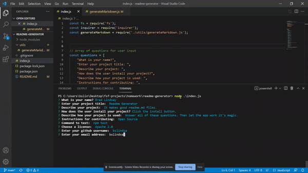

# Readme Generator
  
[](https://opensource.org/licenses/Apache-2.0)

## Description

This application accepts user input about a project and will automatically generate a professional README.md file to describe the details of the project.

## Table of Contents
* [Installation](#installation)
* [Usage](#usage)
* [License](#license)
* [Contributing](#contributing)
* [Tests](#tests)
* [Questions](#questions)
   
<a name="installation"></a>
## Installation

There are no current methods of installing this project.

<a name="usage"></a>
## Usage

This README generator will prompt the user to answer several questions about their project. After all of the questions are answered, the code will automatically insert the input into the template to create a professional README.md file.

The following video demonstrates the application functionality:

https://watch.screencastify.com/v/1DpuT7ahO8Hqmc7X8Iyi


<a name="license"></a>
## License

This project is licensed under the Apache 2.0 license.
undefined

<a name="contributing"></a>
## Contributing

Open source

<a name="tests"></a>
## Tests
To run tests, use the following command:
```
npm test
```

<a name="questions"></a>
## Questions

Github Username: bslindsa 

Email: bslindsa@gmail.com

